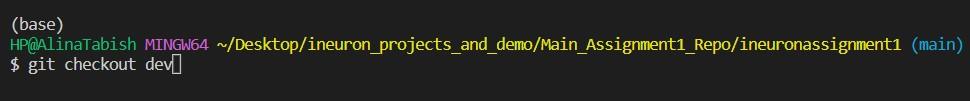

# Git 15 commands List

## git init
### It will initiate the repository

## git status
### It will provide the status of file changed or new file or folder being created

## git add <filename>
### It will add the changed file to the local repository

## git commit -m "message details"
### It will commit the changes to the local.

## git push origin main
### It will push the changes to the main repository

## git pull
### It will pull the changes from the main repository whenever the new chnages are available

## git config
### It will configure the username and email so that we can access the git account

## git log
### It will provides the history of the changes to the main repository

## git merge
### It will merge the changes to the main repository from the newly created branch and vice versa

## git diff <branchname>
### It will provide the changes happened to the main branch and newly created branch

## git reset <filename>
### It will unstaged changes of the files which we added

## git reset HEAD~1
### It will unstaged changes of the last commit made.

## git branch <branchname>
### It will create new branch but will points to the previous branch

## git checkout -b <branchname>
## It will create the new branch and points to the branch created.

## git checkout <branchname>
### It will allow to switch between branches

## git checkout -d <branchname>
### It will delete the branch from the repository
